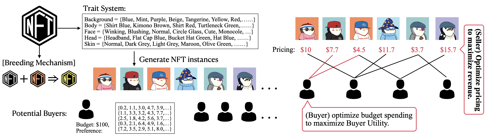

# ICDE24
open source code for ICDE 2024 submission # 774

## Usage
- The long version paper with full theorem proofs can be found in [`doc/ICDE_24_long.pdf`](doc/ICDE_24_long.pdf).
- Code are contained in `/src` directory. Use `getdata.sh` to download the NFT data and `loader.py` for data preprocessing. `main.py` is the main experiment script for solving the The NFT Project Pricing problem
```
cd src
bash getdata.sh
python loader.py 
python main.py
```



